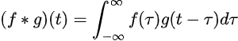

# Report for Convolution

## Abstract

This is a research report about Convolution

## Definition

A convolution is an integral that expresses the amount of overlap of one function g as it is shifted over another function f. It shows as the equation below:



While the symbol t is used above, it need not represent the time domain. At each t, the convolution formula can be described as the area under the function f(τ) weighted by the function g(-τ) shifted by the amount t. As t changes, the weighting function g(t-τ) emphasizes different parts of the input function f(τ); If t is a positive value, then g(t-τ) is equal to g(-τ) that slides or is shifted along the 7-axis toward the right (toward +∞) by the amount of t, while if t is a negative value, then g(t-τ) is equal to g(-τ) that slides or is shifted toward the left (toward-∞) by the amount of |t|.

## The example of Convolution

For example, the convolution can be used for image blurring, edge detection, and sharpening.

The convolution process consists of the following steps:

1. **Selection of a kernel (filter)**: To apply convolution, a small matrix called a kernel (or filter) is first selected. This kernel determines the specific image processing operation to be applied (e.g., edge detection, blurring, etc.).
2. **Applying the kernel to the image**: Starting from the upper left corner of the image, the kernel is slid across the entire image, calculating the sum of the products of the pixel values of the parts of the image that overlap the kernel and each element of the kernel. This sum becomes the new pixel value.
3. **Generate Result**: Repeat this process for the entire image to generate a resulting image with the new pixel values.

Kernel example:
```
-1 -1 -1
-1  8 -1
-1 -1 -1
```
This kernel is used to enhance the edges (boundaries) of an image. When the kernel is applied to an image, values cancel each other out in flat areas of the image and large differences in values occur near edges, resulting in an image with enhanced edges.

## How to apply to our project?

We could use convolution for calculating the accuracy. However, possibly we need to implement kernels to detect how much error we have for the vertical and horizontal. Also, we need to separate vectors by separating with grids at specific locations to apply kernels.

## References

Intuitive guide to convolution. BetterExplained. (n.d.). https://betterexplained.com/articles/intuitive-convolution/ 

Convolution. from Wolfram MathWorld. (n.d.). https://mathworld.wolfram.com/Convolution.html 

What is a convolution? how to teach machines to see images. 8th Light. (n.d.). https://8thlight.com/insights/what-is-a-convolution-how-to-teach-machines-to-see-images 