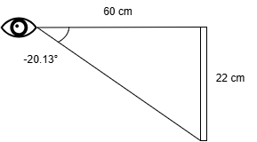
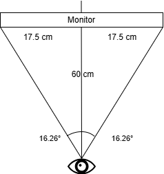

# Headtracking Test Results (Yuuki)

I tested the application with the equipment below:

- Laptop: ROG Zephyrus M16 2022
- Camera: Unknown (Laptop default camera)

## Environment & Anticipated Outcome

### Test for Pitch (up-down):

### Test for Yaw (left-right):

### The expected results are
- -20.13° for Pitch
- 16.26° for Yaw

## Results

### Result for Pitch:

Pitch was -19.90° (0.23° error)

### Result for Yaw

Yaw was 35.84° and -35.51° (19.58° and 19.25° error)