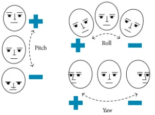

# Report for Head Pose Estimation with MediaPipe and OpenCV

## Overview
In this report, we explore the implementation of head pose estimation using MediaPipe's FaceMesh and OpenCV. The goal is estimating the roll, pitch, and yaw angles of the head.

## Steps for Implementation

### 1. Face Landmarks Detection using MediaPipe FaceMesh
MediaPipe FaceMesh provides a robust solution for detecting 468 facial landmarks. These landmarks are essential for pose estimation as they represent key facial features such as the lips, corners of the eyes, and points on the forehead and cheeks.

**Key steps:**
- Initialize the MediaPipe FaceMesh solution.
  
### 2. Solving the Pose Estimation Problem with OpenCV
The primary goal of pose estimation is to compute the head's rotation and translation relative to the camera. This is done using a combination of 3D-2D point correspondences and solving for the rotation vector (R) and translation vector (t).

OpenCV provides a few key functions for this:
- **cv.solvePnP:** Estimates the pose from 3D-2D point correspondences.
- **cv.Rodrigues:** Converts the rotation vector to a rotation matrix or vice versa.

### 3. Calculating Euler Angles
Using the rotation matrix obtained from OpenCV, the Euler angles (roll, pitch, and yaw) can be calculated manually. These angles give us an intuitive understanding of the head's orientation.

### 4. Projecting Points onto the Image
To visualize the estimated pose, we project 3D points onto the image plane. OpenCV's `cv.projectPoints` function allows projecting 3D points (in world coordinates) onto the 2D image plane using the computed rotation and translation vectors.

### 5. Displaying Results
Once the pose is computed, we can display the results by drawing a line from the tip of the nose to its projected position on the image, indicating the head's orientation.

## What Libraries Should We Use?
We still can use `@mediapipe/face_mesh` in the project. To use OpenCV.js in Typescript, possibly we could use **mirada** with declaring as a global variable.

## Conclusion
By combining the powerful facial landmark detection capabilities of MediaPipe FaceMesh with OpenCV's pose estimation functions, we can achieve accurate and efficient head pose estimation.

## References
- [Head Pose Estimation with MediaPipe and OpenCV in Javascript](https://medium.com/@susanne.thierfelder/head-pose-estimation-with-mediapipe-and-opencv-in-javascript-c87980df3acb)
- [How to use OpenCV.js with TypeScript](https://medium.com/@dev-afzalansari/how-to-use-opencv-js-with-typescript-31095fd5a2feb)
